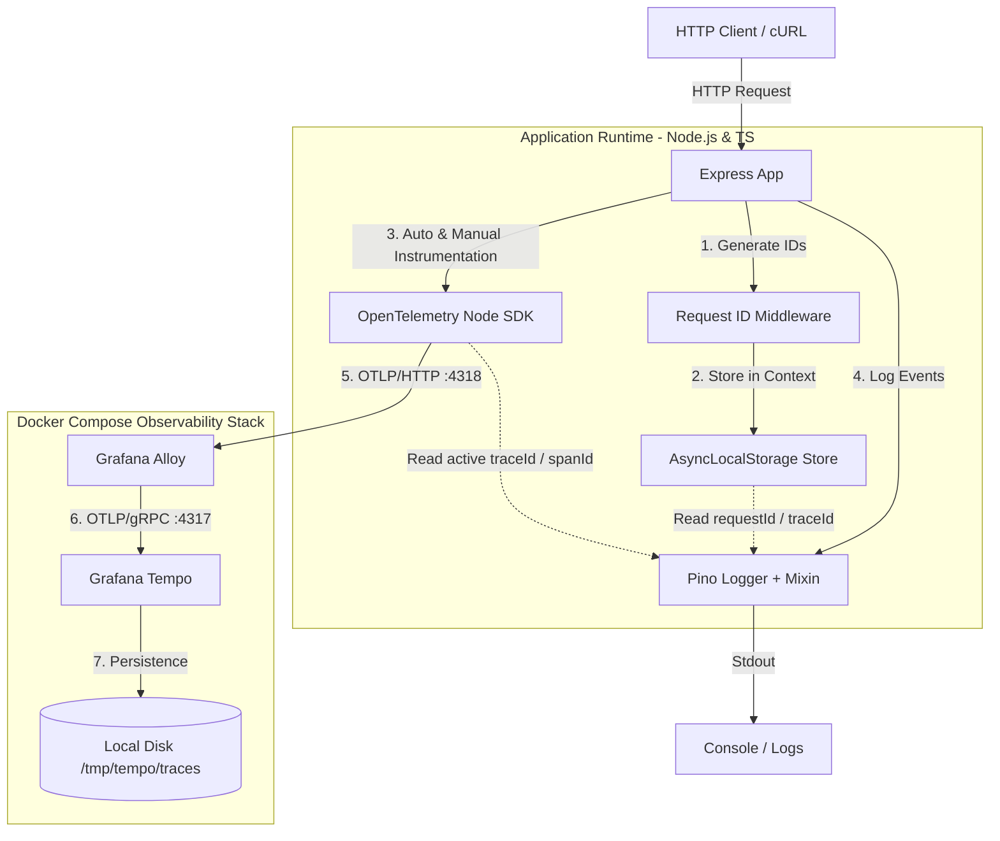

# Observability & Distributed Tracing Ecosystem (Todos API)

This project is a production-grade demonstration of structured logging, asynchronous context propagation, and distributed tracing. It showcases how to correlate log entries with request contexts and OpenTelemetry trace spans, propagating telemetry data through a local observability stack containing Grafana Alloy and Grafana Tempo.

---

## 🏗️ Architecture Overview

The system follows a modern decoupled observability architecture. Tracing spans are captured automatically or manually, exported out-of-process via OTLP (OpenTelemetry Line Protocol), buffered/transformed by a telemetry agent, and stored in a specialized backend.



### Telemetry Pipeline Flow
1. **Request Ingestion**: An incoming HTTP request hits the Express server.
2. **Context Setup**: The middleware generates unique identifiers (`requestId`, `traceId`) and binds them to the execution thread's context using Node.js `AsyncLocalStorage`.
3. **Trace Generation**: The OpenTelemetry Node SDK automatically catches the request, starts a trace span, and sets up context tracing.
4. **Log Correlation**: When log events occur via `Pino`, a mixin function runs to pull the `requestId` from `AsyncLocalStorage` and the active `traceId` / `spanId` from OpenTelemetry, appending them to the log JSON.
5. **Telemetry Export**: The OpenTelemetry SDK exports the collected spans in batches to **Grafana Alloy** using OTLP over HTTP.
6. **Collection & Forwarding**: Grafana Alloy processes and routes the spans via OTLP over gRPC to **Grafana Tempo**.
7. **Storage**: Grafana Tempo indexes and persists the traces to local storage.

---

## 🛠️ Technology Stack & Role of Each Component

### 1. Application Layer & Execution Environment
*   **Express 5**: The routing and web service layer. It defines API endpoints for managing the lifecycle of `Todo` items.
*   **TypeScript**: Provides type safety, autocompletion, and compiles down to ES Modules. Using TypeScript ensures that structures like log payloads and custom Request properties remain correct.
*   **tsx**: An execution engine that runs TypeScript files directly without a manual compilation step, using ESBuild under the hood for fast startup times.

### 2. Context Management
*   **AsyncLocalStorage (Node.js Core API)**:
    *   *What it does*: It allows sharing variables (like `requestId`) across asynchronous call stacks (callbacks, promises) without passing them explicitly as arguments to every function.
    *   *Why it's important*: Manually threading request IDs or logger instances through every database query, service helper, and validation layer creates noisy, error-prone code. `AsyncLocalStorage` keeps the codebase clean by maintaining context implicitly.

### 3. High-Performance Logging
*   **Pino**:
    *   *What it does*: A structured JSON logger designed to be extremely fast with minimal overhead.
    *   *Why it's important*: Standard `console.log` statements are blocking, synchronous, and output unstructured text that is hard for indexing tools (like Loki or Elasticsearch) to parse. Pino formats logs as single-line JSON events and supports a `mixin` function to automatically inject context fields into every statement.
*   **Pino-Pretty**: Used in local development to format the raw JSON logs into human-readable, colorized output.

### 4. Distributed Tracing
*   **OpenTelemetry SDK & API (`@opentelemetry/sdk-node`, `@opentelemetry/api`)**:
    *   *What it does*: Instrument the application to track "spans" (units of work with a start time, duration, and metadata).
    *   *Why it's important*: Tracing is critical for understanding latency. While logs tell you *what* happened, traces show *where* time was spent (e.g., waiting on a database query or an external API).
*   **OpenTelemetry Auto-Instrumentations (`@opentelemetry/auto-instrumentations-node`)**:
    *   *What it does*: Automatically hooks into standard modules (like `express`, `http`, `pg`, `redis`) to trace request handlers and out-of-process calls without requiring you to write manual tracing code.
*   **OTLP Trace Exporter (`@opentelemetry/exporter-trace-otlp-http`)**:
    *   *What it does*: Exports span data out of the application process to the collector using the industry-standard OTLP protocol.

### 5. Telemetry Pipelines & Storage
*   **Grafana Alloy**:
    *   *What it does*: A highly-scalable telemetry collector agent. It listens for OTLP traces, metrics, and logs, processes them (filtering, redacting, batching), and sends them to storage backends.
    *   *Why it's important*: Offloading transmission concerns from the application to Alloy ensures that if the telemetry backend (Tempo/Loki) experiences downtime, Alloy can buffer the data, preventing data loss and keeping the application lightweight.
*   **Grafana Tempo**:
    *   *What it does*: A high-scale, low-cost object-storage-based tracing backend.
    *   *Why it's important*: It acts as the central database where you query and visualize trace spans, enabling developer tools like Grafana to display gantt charts of request lifecycles.

---

## 🚀 How to Run the Whole System

Follow these steps to run the complete local observability stack and application.

### 📋 Prerequisites
Ensure you have the following installed on your machine:
*   [Node.js](https://nodejs.org/) (v18 or higher recommended)
*   [Docker](https://www.docker.com/) & [Docker Compose](https://docs.docker.com/compose/)

---

### Step 1: Install Node.js Dependencies
Navigate to the root directory of the project and install the dependencies:
```bash
npm install
```

### Step 2: Start the Observability Stack (Alloy & Tempo)
Bring up the containerized observability infrastructure:
```bash
docker compose -f observability/docker-compose.yml up -d
```
*   This starts **Grafana Tempo** listening on port `3200`.
*   This starts **Grafana Alloy** listening for OTLP traces on port `4317` (gRPC) and `4318` (HTTP).

To check the status of the containers:
```bash
docker compose -f observability/docker-compose.yml ps
```

### Step 3: Run the Application
Start the Express server. The server must be started via `src/bootstrap.ts` to ensure the OpenTelemetry SDK initializes and starts instrumenting standard modules *before* any other dependencies (like Express) are loaded.

**Default mode (Pino-pretty logs, Info level):**
```bash
npx tsx src/bootstrap.ts
```

**Production-like mode (Raw JSON logs):**
```bash
NODE_ENV=production npx tsx src/bootstrap.ts
```

**Debug mode (Capture Trace/Debug logs):**
```bash
LOG_LEVEL=trace npx tsx src/bootstrap.ts
```

The server will start and listen on port **`3000`**.

---

## 🧪 Verifying the System (List of Commands)

You can trigger different log scenarios, tracing behaviors, and error conditions using the following `curl` commands:

### 1. Manage Todos (Basic CRUD)
Create a new Todo (creates an OpenTelemetry active span `create_todo` and records a structured Pino log):
```bash
curl -X POST http://localhost:3000/todos \
  -H "Content-Type: application/json" \
  -H "x-user-id: user-45" \
  -d '{"title": "Learn OpenTelemetry"}'
```

Fetch all Todos:
```bash
curl http://localhost:3000/todos
```

Update a Todo (triggers an **Audit Log** tracking the user and resource context):
```bash
# Note: replace 123 with a valid timestamp ID returned from the POST response
curl -X PUT http://localhost:3000/todos/123 \
  -H "Content-Type: application/json" \
  -H "x-user-id: user-45" \
  -d '{"title": "Learn OpenTelemetry (Updated)"}'
```

Mark a Todo complete:
```bash
curl -X PATCH http://localhost:3000/todos/123/complete -H "x-user-id: user-45"
```

Delete a Todo:
```bash
curl -X DELETE http://localhost:3000/todos/123 -H "x-user-id: user-45"
```

---

### 2. Test Observability & Tracing Features

#### Test Log Levels Filtering
Trigger five consecutive log statements from `trace` to `error` to verify log level filtering configuration:
```bash
curl http://localhost:3000/todos/test-levels
```

#### Test Telemetry Context & Spans
Test whether OpenTelemetry auto-instrumentation correctly captures request traces:
```bash
curl http://localhost:3000/todos/otel-test
```

Generate a manual trace span representing a database query (simulating a `500ms` delay):
```bash
curl http://localhost:3000/todos/manual-span
```

#### Test Error & Exception Tracking
Trigger an unhandled server error (verifies error serialization inside Pino logs):
```bash
curl http://localhost:3000/todos/error
```

Trigger a client-side validation error (results in an HTTP 500 error but with specialized stack details):
```bash
curl http://localhost:3000/todos/validation-error
```

#### Test Performance Metrics Logging
Log a custom performance metric record:
```bash
curl http://localhost:3000/todos/performance-test
```

Measure an asynchronous slow database query (simulating a `2000ms` delay with execution duration logging):
```bash
curl http://localhost:3000/todos/slow-operation
```

Measure a failing asynchronous database query (logs execution duration alongside error logs):
```bash
curl http://localhost:3000/todos/performance-error
```

---

## 🔍 Log-Trace Correlation Details

In Pino logs, look for the following fields in the JSON output (or pretty-printed metadata):
*   `requestId`: Generated by `requestIdMiddleware` on every incoming request to uniquely identify it.
*   `traceId`: Propagated by OpenTelemetry across different systems or generated for the transaction.
*   `spanId`: Represents the current active block of execution within that request.

**Example Structured Log Output (Raw):**
```json
{"level":30,"time":"2026-06-15T03:45:00.000Z","pid":4561,"hostname":"local","service":"todo-api","environment":"development","requestId":"5904d9a1-cb3e-4623-a5a4-c2b9ba6d3fe7","traceId":"a3c54189a1ba55fb7ab1fb45a491388b","spanId":"33e94aef144be3b3","resource":{"type":"todo","id":1718434567890},"msg":"Todo created"}
```
By copy-pasting the `traceId` into your visualization frontend (like Grafana connected to Tempo), you can inspect the exact trace execution graph corresponding to that log line.
